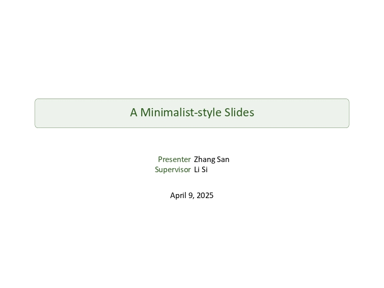
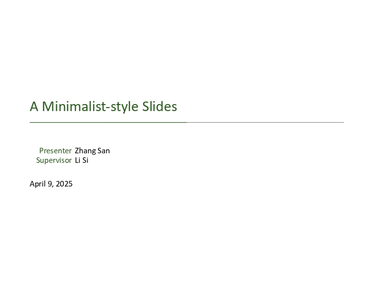
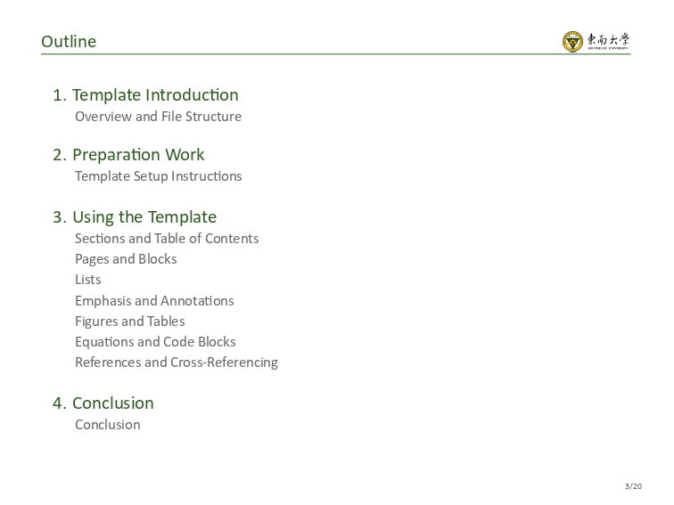
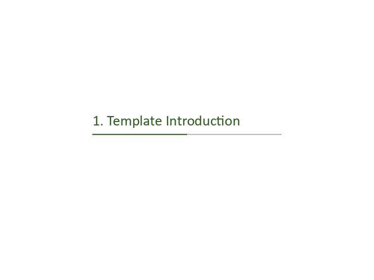
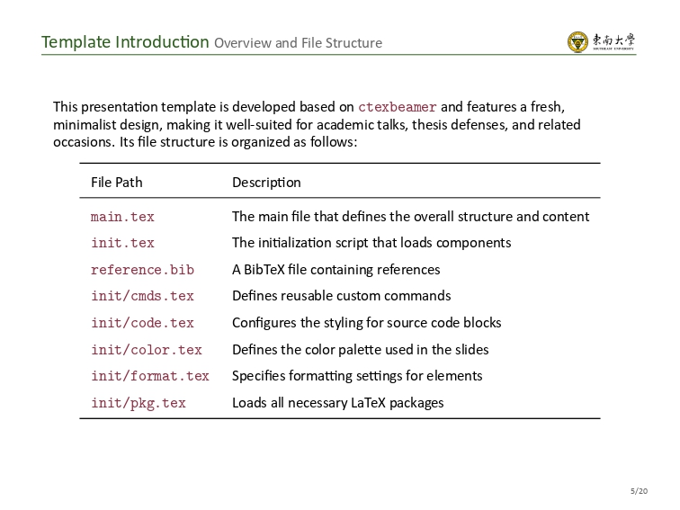
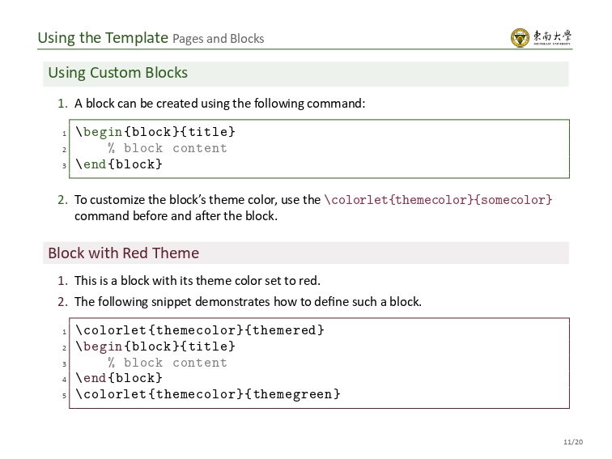
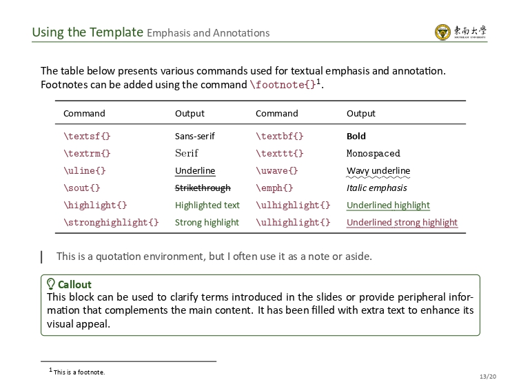
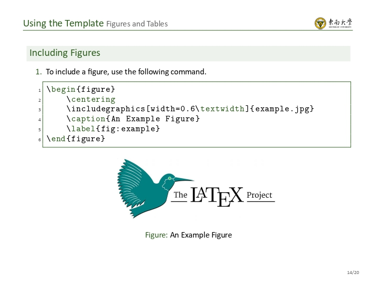

# Minimalist Slides

This minimalist slide template, built on LaTeX Beamer, features a Southeast University theme by default. Users can effortlessly tailor it to reflect the branding of other institutions with minimal adjustments.

## Features

- Clean and elegant design, well-suited for academic presentations, thesis defenses, and similar professional settings
- Seamless integration of images, tables, equations, and code blocks
- Fully customizable theme color options

## Example

- Shown below are the default Southeast University theme styles:

  
  
  
  
  
  
  
  

## Usage Instructions & Additional Information

For complete usage guidelines and more details, please consult the `main.pdf` file.